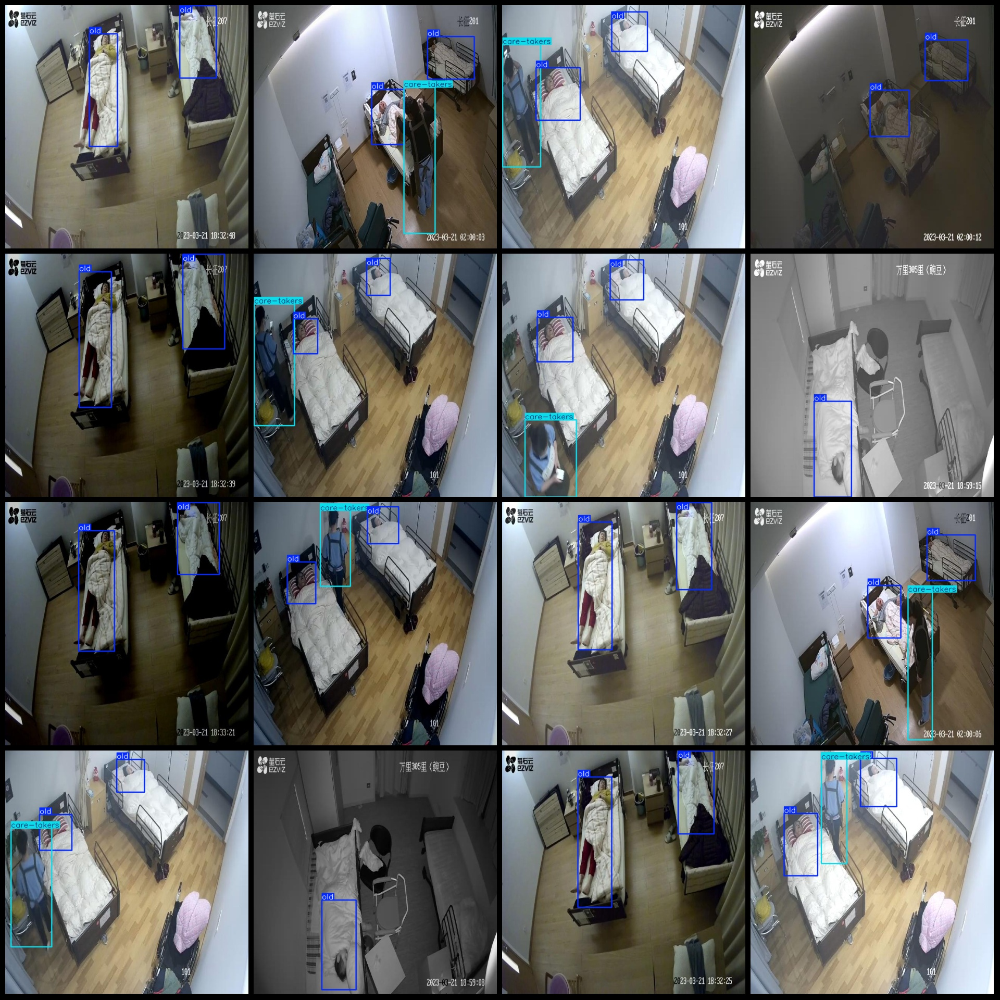
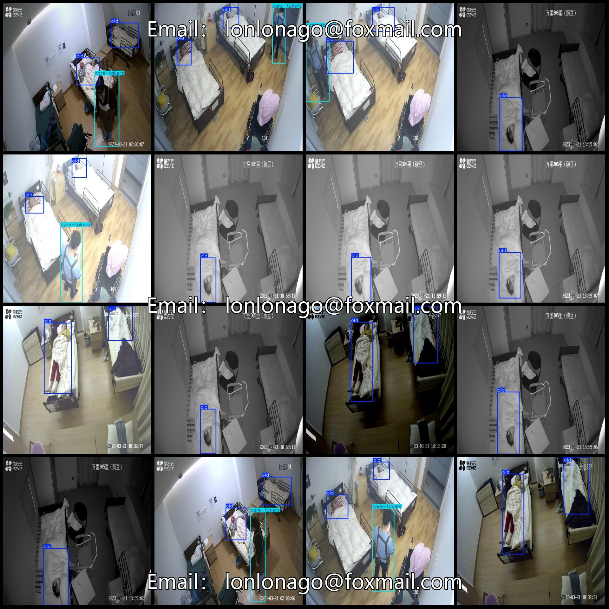

# Hospital and Nursing Home Care Staff and Patients Detection Dataset VOC+YOLO Format, 593 Images, 2 Categories

Note: Approximately 230 images are in their original form, with the remaining being enhanced generated images.
Dataset format: Pascal VOC format + YOLO format (without split path's txt file, only containing jpg images along with corresponding VOC format xml files and YOLO format txt files).
Number of images (jpg file count): 593
Number of annotations (xml file count): 593
Number of annotations (txt file count): 593
Number of annotation categories: 2
Annotation category names (note that the order in YOLO format does not match this, but is in accordance with the labels folder classes.txt): ["care-takers", "old"]
Each category has a number of bounding boxes:
care-takers = 248
old = 1047
Total bounding box count: 1295
Each category occupies a number of images:
care-takers occupies images = 248
old occupies images = 593
Image resolution: 640x640
Used annotation tool: labelImg
Annotation rules: Draw bounding boxes for each category
Important note: The dataset does not have been split into training, validation, or test sets; it needs to be manually divided.
Special declaration: This dataset does not guarantee the accuracy of models trained on it or weights files.
Image preview:
Annotation examples:

## Images

Here is a pay link on Stripe ( https://buy.stripe.com/3cs8yP7sY87d0vu9AB ). Please contact me lonlonago@foxmail.com after funding $89, and I will send you a complete data files , thank you!

